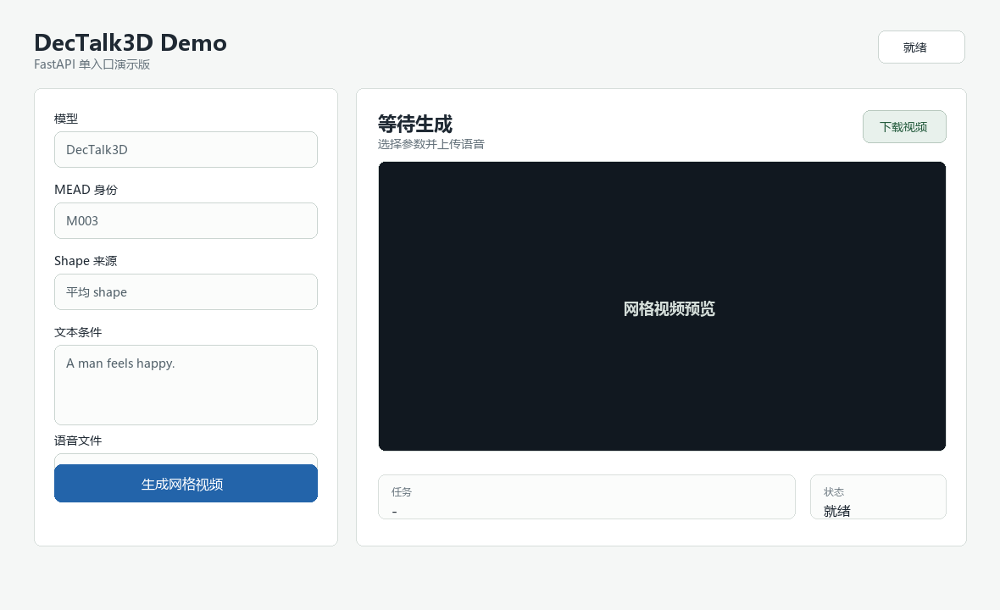

# DecTalk3D Demo

这是一个面向 Windows 的 WebUI Demo，用于统一运行 **DecTalk3D** 和 **ProDecTalk3D**。

用户上传语音、输入文本、选择 MEAD 身份和 shape 身份后，系统输出 FLAME 网格视频，并保留后续接入 3DGS 渲染所需的驱动参数。



## 特性

- 支持 `DecTalk3D` 与 `ProDecTalk3D` 两个模型。
- 支持语音、文本、身份向量和 shape 身份输入。
- shape 可选择 `dataset/mean_shape` 中的身份平均 shape，或使用 `0shape`。
- 渲染方式与 DecTalk3D / ProDecTalk3D 原始渲染脚本保持一致。
- 输出浏览器可播放的 H.264 `mesh.mp4`。
- 保存 `drive_params.npz`，为后续 3DGS 渲染预留接口。

## 项目结构

```text
configs/          模型与 Demo 配置
web/              内置前端页面
src/              FastAPI、推理封装、预处理和渲染代码
third_party/      DecTalk3D / ProDecTalk3D 必要源码
external/         GaussianAvatars、nvdiffrast 等 3DGS 预留代码
assets/           Demo 实际使用的 FLAME 文件、身份列表和预训练缓存
dataset/          mean_shape 等数据
weights/          模型权重
runtime/          上传文件、任务记录和生成结果
```

## 环境

依赖：

- Python 3.8
- Conda
- FFmpeg（需自行安装并加入 `PATH`）
- NVIDIA GPU + CUDA（推荐）

```powershell
conda env create -f environment.yml
conda activate dectalk-demo

pip install -r requirements-torch-cu121.txt
pip install -r requirements.txt
```

如果只验证流程、不使用 GPU，可将第一条 pip 命令替换为：

```powershell
pip install -r requirements-torch-cpu.txt
```

## 权重

百度网盘只存放 `dataset/` 和 `weights/` 下的文件：

```text
链接：待补充
提取码：待补充
```

下载后保持以下目录结构：

```text
dataset/
weights/
```

其中模型权重默认路径为：

```text
weights/dectalk/generation.pth
weights/prodectalk/diffusion.pth
```

当前第二阶段 checkpoint 已包含完整推理参数，只需要上面两个权重文件。

## 预训练缓存

首次运行前建议先下载 HuBERT / OpenCLIP 缓存：

```powershell
python scripts/download_pretrained.py
```

缓存会保存到：

```text
assets/pretrained/
```

## 运行

```powershell
python run_app.py
```

打开：

```text
http://127.0.0.1:8000
```

网页中选择模型、MEAD 身份、shape 身份，填写文本并上传语音后，点击“生成网格视频”。

## 输出

每个任务会写入：

```text
runtime/outputs/{job_id}/mesh.mp4
runtime/outputs/{job_id}/mesh_silent.mp4
runtime/outputs/{job_id}/vertices.npy
runtime/outputs/{job_id}/drive_params.npz
```

- `mesh.mp4`：最终网格视频。
- `vertices.npy`：FLAME 顶点序列。
- `drive_params.npz`：包含 `vertices / exp / jaw / shape / valid_len / person_id / shape_id / text / model`，用于后续 3DGS 渲染。

## 引用

如果本 Demo 或相关模型对你的研究有帮助，请引用原始项目：

```bibtex
@article{dectalk3d,
  title   = {分层解耦引导的情感可控VQ-VAE 3D说话人脸生成方法},
  author  = {陈胜 and 孙强 and 朱霞天},
  journal = {中国图象图形学报},
  year    = {2026},
  pages   = {1--15},
  doi     = {10.11834/jig.250451},
  url     = {http://cjig.cn/zh/article/doi/10.11834/jig.250451/}
}

@misc{prodectalk3d,
  title  = {ProDecTalk3D: Controllable 3D Talking Face Generation with Progressive Decoupling and Vector Quantized Diffusion},
  author = {Chen, Sheng and Sun, Qiang},
  note   = {Unpublished manuscript and code available at https://github.com/chen114514sheng/ProDecTalk3D}
}
```

相关仓库：

- DecTalk3D: https://github.com/chen114514sheng/DecTalk3D
- ProDecTalk3D: https://github.com/chen114514sheng/ProDecTalk3D
